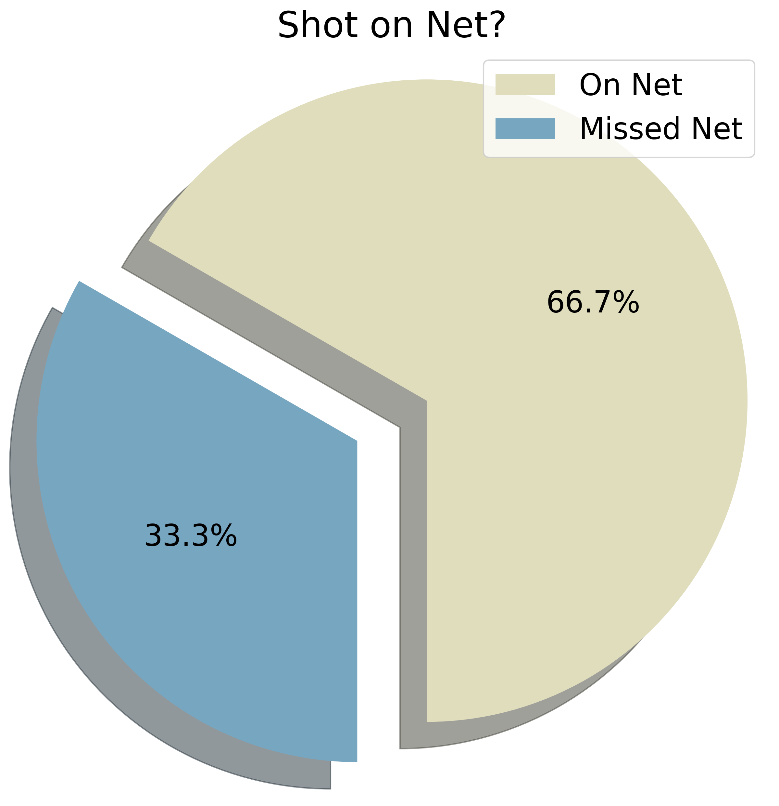
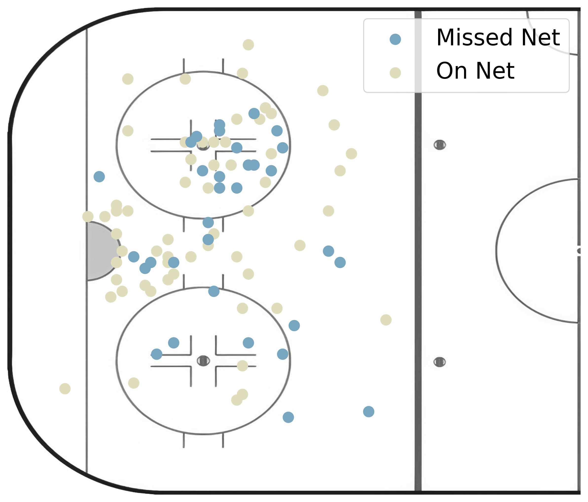
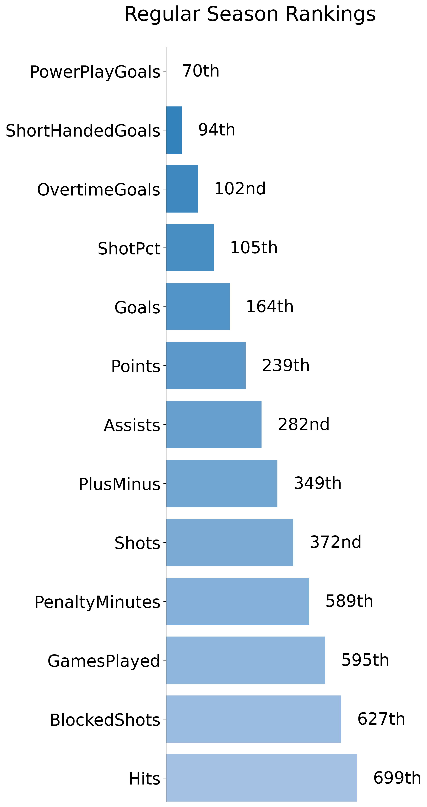

# Sports Analytics

## Overview / Purpose

The generated report is meant to provide coaches and players with a snapshot of their overall performance for a given season. The report can also be used by opposing teams to get a sense of where specific players are threatening in the offensive zone. This can be useful in guiding player development, or preparing players for likely matchups in upcoming games.

I decided to work with all the data from the 2011 - 2012 season onwards given that most players in the league today have been in the league for under 10 years.

## API Requests (Grequests)

The first part of the project involved querying the NHL API to get all the games, players, events during games, rankings, general statistics and more. Given that the NHL_API server does not have any API limiting, we can leverage the power of asynchronous requests and get information much faster. 

See more about the NHL API here --> [NHL Api Docs](https://gitlab.com/dword4/nhlapi/-/blob/master/stats-api.md#configurations)

Asynchronous requests basically send requests in parallel to reduce the time spent waiting for data to be send from the server. That being said, doing large scale requests in parallel can create sever lag, so I performed these requests in batches of 100 to reduce server strain. 

For each batch, the API returns data in a JSON format and I used a context manager to write this to disk. 

## JSON to Parquet (Pyspark)

Although JSON will work for small datasets, I wanted to convert the JSON data to Parquet to consume less space, limit IO operations, and increase scalability. The benefits of this data format conversion become more evident as the size of the dataset grows. 

## Genenerating Plots (Matplotlib, Pandas)

Currently, there are 5 plots generated with Matplotlib on the reports. First of all, using Pypark we filter our dataset based on the player_id and the season specified, and then convert that data to a pandas data frame (which can be read by matplotlib).

The first two plots are pie plots that show the players shot accuracy, and percentage of shots that result in a goal. The following is an example of the shot/goal percentage pie plot. 

The next two plots are scatter plots that show the location of the player shots on the ice. In one plot, shots are marked as either a goal or no goal, and in the other plot, shots are marked as on-net or missed net. This is indicated by the color of the markers and the plot legend.

For examlple, here is an example of the player shot accuracy scatter plot

The initial rink image was in color, and needed some edits were needed to make it easier to view the plot. Given I am on a student budget, photshop was out of the question, but there is a great alternative called Photopea. This in-browser, free tool works similarly to photoshop, and was perfect for the small edits needed for the image.

Check out PhotoPea here --> https://www.photopea.com/

The final plot that was generated with Matplotlib was the horizontal bar plot that indicates the season ranking for the player. The color scheme and style of the plot is motivated by Tableau style bar plots. When selecting the optimal colors for the report I used colormind, and also dopelycolor's color blender tool to create gradients. 

Here is an example of the bar plot that is included in the report

Check out Colormind here --> http://colormind.io/

Check out dopelyColors here --> https://colors.dopely.top/color-blender/
 
## PDF Generation (FPDF)

"PyFPDF is a library for PDF document generation under Python, ported from PHP"

This library was very interesting to work with. Although there is some documentation, it was not always comlpete and required experimentation to achieve a desired result. This package is very customizable, and is well suited to automate professional report generation.

I used this package in this project to create a title page, footer, header, page count, and insert the matplotlib plots. Once all the information was added the report, the report is saved in a PDF format.

See more about the FPDF Library here --> [FPDF Documentation](https://pyfpdf.readthedocs.io/en/latest/index.html)

Other Thoughts

- Inititially it was taking ~7mins to generate each report using .png images, but this decreased to ~10 seconds when using a jpg/jpeg format. Without images on the report, the PDF generation is quite fast and runs in <1sec

- Its important to keep track of the page dimensions, because componenets are mostly added on a coordinate basis

## Improvements / Additions

- There is not a great way of looking up player_ids without going to NHL.com and manually searching the player, then selecting the ID from the URL. This could be solved with somesort of bash auto-complete package? Not sure if there are any tools for this.

- I have not put any significant player_id checks to ensure that the id entered is correct. Currently, the code will throw an error because the data_query does not produce enough information to generate all the plots. The same problem occurs if a goalie ID is entered or if a player ID is correct, but did not play in the NHL that season. 

- The data is currently stored locally as parquet files, but in production it would more likely be in a Database / Cloud storage. Could be useful storing this data elsewhere.

## Running the Code

To run the code in the project and start generating reports, follow the steps below. 

1. Install requirements with pip

`pip install -r requirements.txt`

2. Make API query to build dataset

`python data_gathering/api_functions.py` 

Note: Try and do this step outside of game times (when server has low traffic) as this will take roughly 15-20 mins depending on connection
 
3. Convert JSON to Parquet

`python data_gathering/json_to_parquet.py` 

4. Generate reports based on ID and Season

`python generate_pdf.py <PLAYER_ID> <SEASON>`

ex. TJ Oshie - 2020/2021 Season

`python generate_pdf.py 8471698 20202021`

ID Sample's
- Hoglander - 8481535
- Oshie - 8471698
- Marchand - 8473419

Season Samples
- 20202021
- 20132014
- 20162017